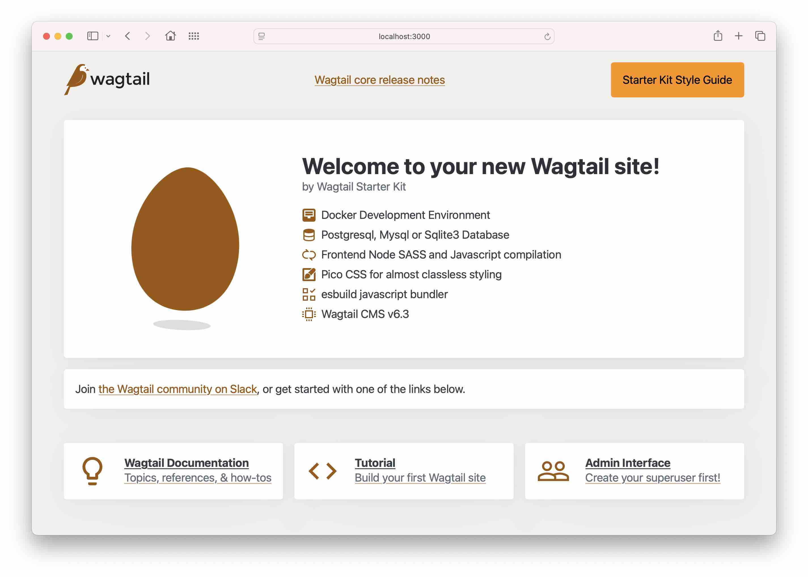

# Wagtail Starter Kit (base)

This is a starter kit for a Wagtail project. It includes a Docker setup for local development, a basic project structure, and some useful tools and libraries.

You can use this project as a starting point for your own Wagtail projects and build upon it as needed.

## Features

- Docker Development Environment
- Postgresql, Mysql or Sqlite3 Database
- Frontend Node SASS and Javascript compilation
- Pico CSS for almost classless styling
- esbuild javascript bundler
- Wagtail CMS v6.3



## Requirements

Required:

- [Python >= 3.10](https://www.python.org/downloads/) (developemnt and deployment)
- [Docker](https://www.docker.com/) (for local development)
- [Docker Compose](https://docs.docker.com/compose/) (for local development)
- [Node.js](https://nodejs.org/en/) (for frontend build tools) (for frontend build tools in development)

Optional:
- [Git](https://git-scm.com/) (optional, for version control)
- [Make](https://www.gnu.org/software/make/) (optional, for running commands)
- [NVM](https://github.com/nvm-sh/nvm) (optional, for managing Node versions)
- [pre-commit](https://pre-commit.com/) (optional, for running code checks)
- [UV](https://github.com/astral-sh/uv) (optional, for managing Python dependencies)

## Getting started

1. Clone this repository [https://github.com/wagtail-examples/wagtail-starter-kit.git](https://github.com/wagtail-examples/wagtail-starter-kit.git) to a location on your computer
2. Change into the project directory
3. Run `make build` to build the Docker containers
4. Run `make up` to start the Docker containers
5. Run `make migrate` to apply database migrations
6. Run `make superuser` to create a superuser
7. Run `make run` to start the Django development server

### Quick start

There is a make command to run most of the steps above in one go:

```bash
make quickstart
```

You'll need to run `make superuser` separately.

If you haven't made changes to the configuration the app will have available the following services for use in development:

- Use sqlite as the database
- A mail utility will be available at [http://localhost:8025](http://localhost:8025)
- A database management utility will be available at [http://localhost:8080](http://localhost:8080)

## Working with the fronend

The project uses [Pico CSS](https://picocss.com/) for styling. It's a minmal setup that you can build on.

When you first run the project you may notice that no styling is applied. This is because the first time you run the project with `make up` the compiled frontend files might not be available. Just run the frontend build script and refresh the page. [Read on](./docs/frontend-development.md)

## Working with the backend

The project uses Docker for local development. The Wagtail project is in the `app` directory. The project is set up to use a SQLite database by default. You can change this to use Mysql or Postgres. [Read on](./docs/backend-development.md)

## View the site

The site will be available at [http://localhost:8000](http://localhost:8000).

The Wagtail admin interface will be available at [http://localhost:8000/admin](http://localhost:8000/admin).

## Deployment

Currenyly there is no deployment setup included in this project. You could try this [Wagtail deployment guide](https://docs.wagtail.org/en/stable/deployment/index.html) for some ideas.

## Deployment Examples

1.  How to deploy a Wagtail site to [PythonAnywhere](https://www.nickmoreton.co.uk/articles/deploy-wagtail-cms-to-pythonanywhere/), this does need you to have a paid account with PythonAnywhere.
2. This [example](https://github.com/wagtail-examples/wsk-deploy-python-anywhere) is a fork of this starter kit which has documentation on how to deploy to PythonAnywhere, using a free account.

## Bonus branches

There are 2 branches that you can use to explore more features of the project:

- [Wagtail 'Getting Started Tutorial' PR](https://github.com/wagtail-examples/wagtail-starter-kit/pull/3) Is a run through of the official Wagtail Getting Started tutorial where a simple blog is created.
- [Wagtail 'Extended Tutorial'](https://github.com/wagtail-examples/wagtail-starter-kit/pull/4) Is a run through of the official Wagtail Extended Tutorial where the Getting Started Tutorial is extended to include more features.

## Contributing

If you have any suggestions or improvements, please open an [issue](https://github.com/wagtail-examples/wagtail-starter-kit/issues) or a [pull request](https://github.com/wagtail-examples/wagtail-starter-kit/pulls).

## License

This project is licensed under the MIT License - see the [LICENSE](LICENSE) file for details.
